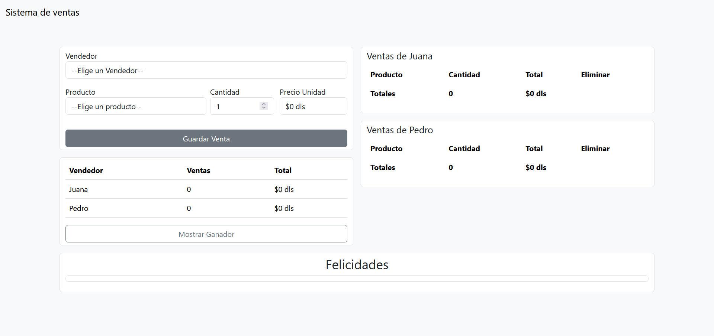
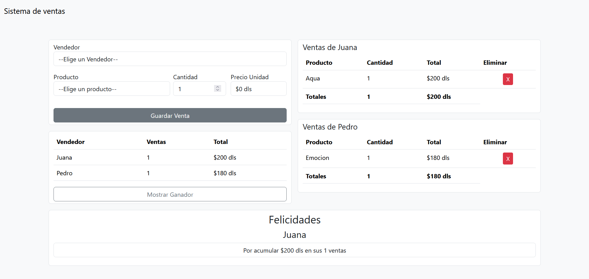

# ejercicios-sistema-ventas

## html css js

La aplicación esta realizado con JS, HTML y CSS con los frameworks de Boostrap 5.5 (cdn) y alertas con Sweetalert2.

Sigue los siguientes lineamientos 

La empresa perfumes latinos premiará a su empleado del mes (quien más dinero recaude en ventas) con una comisión y requiere un programa que almacene y muestre:
 
Qué cantidad de cada productos vendió cada vendedor. 
La suma total de dinero recolectada por cada vendedor. 
Nombre del empleado del mes, en caso de haber vendido lo mismo indicar que fue un empate. 
La empresa actualmente cuenta con los siguientes 4 productos que tienen los siguientes nombres y precios: 
 
Aqua: 200 usd. 
Emoción: 180 usd. 
Alegría: 160 usd. 
Frescura: 150 usd. 
Y dos vendedores Juana y Pedro. 
 
Notas. 
Los resultados deben visualizarse en consola y deben activarse a través de botones. 
El programa debe validar y mostrar un mensaje de error si no se ingresa un valor numérico.(Opcional). 
Debe hacer uso de funciones, arrays y estructuras de control para resolver el ejercicio. 
Realizar el ejercicio por medio de cualquiera de los métodos de salidas en JS (console, alert o document). 

## Accede la app de Banco en el siguiente [Sistema de ventas](https://isaacmb-alfa.github.io/ejercicios-sistema-ventas/).

## Descripción

Esta aplicación esta construida con vanila JavaScript en su mayor parte.

## Visuales de la app

    
     
    

    

---

### Modo de empleo 🔧

La app sirve para registrar ventas por cada uno de los vendedores y las muestra en pantalla.

Si la vetna ya se habia efectuado antes no agrega una nueva linea, solo modifica la cantidad sumando lo que se envie en el formulario de cantidad.

Si se desea eliminar un conjunto de ventas, se puede realizar por medio del botón rojo al final de la linea. Este botón muestra una alerta de confirmación o negación de la acción para que el usuraio pueda cancelar la acción.

---

⌨️ con ❤️ por [Isaac Manríquez](https://github.com/isaacmb-alfa) 😊
